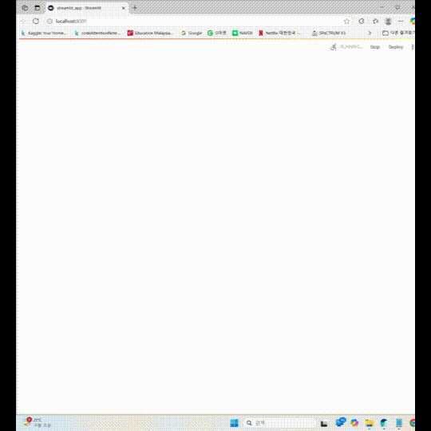
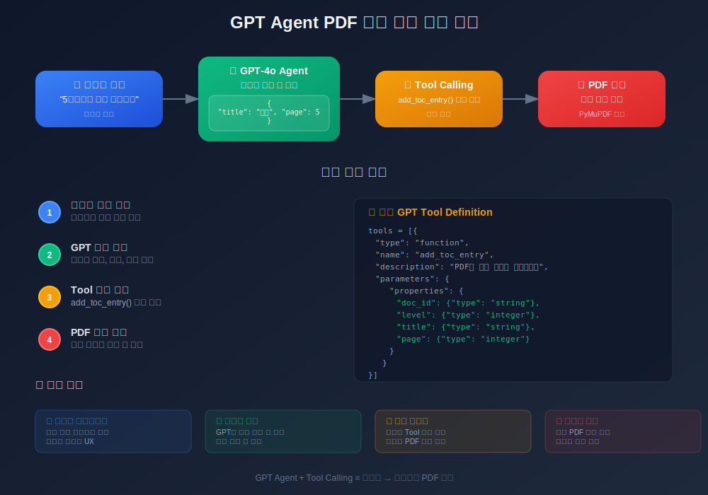

# 📄 GPT 기반 PDF 목차 자동 생성기

> 수정 및 보완 필요한 것들
> - 현재는 tool이 사실상 1개(add_toc_entry)임 -> open_pdf 등의 함수도 자동으로 호출되도록 바꿔야함
> - 현재는 OpenAI client만 호출해서 구현했지만 langchain 혹은 langgraph 기반으로 코드 바꾸는 게 편리할듯
> - PDF 목차만들기보다 word 파일 만들기 or ppt 파일 만들기로 AGENT 컨텐츠 구성하는 게 좋을듯



---

> 자연어로 명령하면 **GPT Agent**가 PDF에 자동으로 목차를 추가해주는 웹앱  
> 교육용 프로젝트 (Streamlit + GPT-4o + OCR + PyMuPDF)

---

## 핵심 개념: **GPT Agent + Tool 사용**

이 앱은 **OpenAI의 GPT Agent**가 자연어 명령을 분석하고, 정의된 **함수 (Tool)**를 직접 호출하는 구조로 작동합니다.

### 흐름

1. 사용자가 입력: `"5페이지에 서론 추가해줘"`
2. GPT는 다음과 같이 파악:
   ```json
   {
     "doc_id": "...",
     "level": 1,
     "title": "서론",
     "page": 5
   }
    ```
3. GPT가 호출
    ```python
    add_toc_entry(doc_id=..., level=1, title="서론", page=5)
    ```

### 장점
- 사용자는 프로그래밍 없이 자연어로 명령
- GPT가 파라미터 추론 + 함수 호출
- 확장 가능: 다른 Tool 함수도 쉽게 추가 가능

## 주요 기능
- PDF 업로드 및 열기
- GPT에게 명령으로 목차 추가시키기
- OCR 기반 페이지 내용 읽기
- 현재 목차 구조 보기
- 수정된 PDF 다운로드

## 기술 스택
| 기술                 | 설명             |
| ------------------ | -------------- |
| **Streamlit**      | 사용자 인터페이스      |
| **OpenAI GPT-4o**  | 자연어 → 함수 호출    |
| **PyMuPDF (fitz)** | PDF 처리         |
| **EasyOCR**        | 이미지 OCR 텍스트 추출 |
| **Pillow / NumPy** | 이미지 처리         |
| **Logging**        | 앱 상태 추적용       |

## 📁 프로젝트 구조
```
├── pdf_tools.py         # PDF 처리 및 OCR 로직
├── streamlit_app.py     # 웹 UI 및 GPT 통신
├── uploaded_pdfs/       # 업로드된 PDF 저장 폴더
```
## ▶실행 방법
1. 의존 패키지 설치
```bash
pip install -r requirements.txt
```
2. API 키 설정
OPENAI_API_KEY를 환경변수로 설정하거나 코드에 직접 삽입
3. 실행
```bash
streamlit run streamlit_app.py
```

## 교육 포인트
- GPT Tool Calling 구조 실습
- OCR + 자연어 명령 + 자동화 PDF 처리
- 상태 기반 인터랙티브 앱 (Streamlit + session_state)
