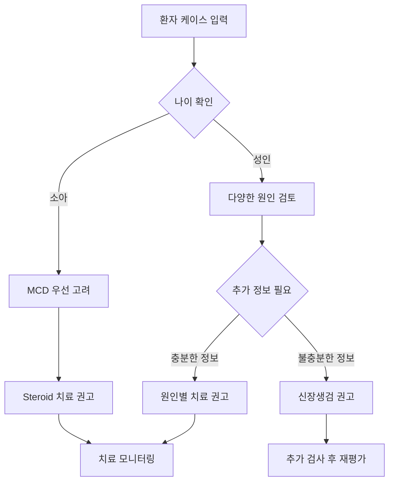

# Nephrotic Syndrome Medical Agent

LangChain을 사용하여 구현한 신증후군 진단 및 치료 추천 에이전트입니다. 구조화된 도구들을 활용하여 의료진의 진단 과정을 지원합니다.

## 🏗️ 시스템 구조

```
┌─────────────────┐    ┌─────────────────┐    ┌─────────────────┐
│   User Input    │───▶│  LangChain      │───▶│   Tool Calling  │
│  (Case Study)   │    │   Agent         │    │   Functions     │
└─────────────────┘    └─────────────────┘    └─────────────────┘
                                │
                                ▼
                       ┌─────────────────┐
                       │   Response      │
                       │  Generation     │
                       └─────────────────┘
```

## 🛠️ 사용 가능한 도구 (Tools)

### 1. `check_nephrotic_syndrome_criteria`
신증후군 진단 기준 충족 여부를 확인합니다.

**입력 파라미터:**
- `proteinuria_g_per_day`: 일일 단백뇨량 (g/day)
- `albumin_g_dl`: 혈청 알부민 수치 (g/dL)
- `edema`: 부종 유무 (boolean)

**진단 기준:**
- 단백뇨 > 3.5 g/day
- 저알부민혈증 < 2.5 g/dL
- 부종 존재

### 2. `suggest_nephrotic_syndrome_cause`
임상 정보를 바탕으로 신증후군의 원인을 감별합니다.

**입력 파라미터:**
- `age`: 환자 나이
- `diabetes`: 당뇨병 유무
- `pla2r_positive`: PLA2R 항체 양성 여부
- `hematuria`: 혈뇨 유무
- `known_cancer`: 알려진 암 병력
- `nephrotic_proteinuria`: 신증후군 수준의 단백뇨
- `response_to_steroid`: 스테로이드 반응성 ("unknown", "good", "poor")

**감별 질환:**
- MCD (미세변화병)
- FSGS (국소분절성 사구체경화증)
- MGN (막신장병)
- DMN (당뇨병성 신장병증)
- 아밀로이드증

### 3. `recommend_nephrotic_syndrome_treatment`
진단된 질환에 따른 치료 방법을 추천합니다.

**지원 진단:**
- `MCD`: Steroid 1차 치료
- `FSGS`: Steroid ± 면역억제제
- `MGN`: ACEi/ARB + 고위험군 면역억제제
- `DMN`: 혈당조절 + ACEi/ARB ± SGLT2i
- `Amyloidosis`: AL/AA type별 특화 치료

### 4. `summarize_nephrotic_syndrome_case`
환자 케이스를 종합적으로 요약합니다.

**입력 파라미터:**
- `age`: 나이
- `sex`: 성별 ("male", "female")
- `proteinuria_g_day`: 일일 단백뇨량
- `albumin_g_dl`: 혈청 알부민
- `edema`: 부종 유무
- `hematuria`: 혈뇨 유무

## 📊 실행 결과 분석

### Case 1: 21세 남성 환자

<svg width="600" height="300" xmlns="http://www.w3.org/2000/svg">
  <defs>
    <marker id="arrowhead" markerWidth="10" markerHeight="7" 
     refX="9" refY="3.5" orient="auto">
      <polygon points="0 0, 10 3.5, 0 7" fill="#333" />
    </marker>
  </defs>
  
  <!-- 배경 -->
  <rect width="600" height="300" fill="#f8f9fa" stroke="#dee2e6" stroke-width="1"/>
  
  <!-- 제목 -->
  <text x="300" y="25" text-anchor="middle" font-family="Arial" font-size="16" font-weight="bold" fill="#333">Case 1: 21세 남성 - Agent 실행 플로우</text>
  
  <!-- Step 1 -->
  <rect x="50" y="50" width="120" height="60" rx="10" fill="#e3f2fd" stroke="#1976d2"/>
  <text x="110" y="75" text-anchor="middle" font-family="Arial" font-size="10" fill="#1976d2">1. Criteria Check</text>
  <text x="110" y="90" text-anchor="middle" font-family="Arial" font-size="8" fill="#333">proteinuria: 10.2g</text>
  <text x="110" y="100" text-anchor="middle" font-family="Arial" font-size="8" fill="#333">albumin: 2.7g/dL</text>
  
  <!-- Arrow 1 -->
  <line x1="170" y1="80" x2="210" y2="80" stroke="#333" stroke-width="2" marker-end="url(#arrowhead)"/>
  
  <!-- Step 2 -->
  <rect x="220" y="50" width="120" height="60" rx="10" fill="#fff3e0" stroke="#f57c00"/>
  <text x="280" y="75" text-anchor="middle" font-family="Arial" font-size="10" fill="#f57c00">2. Cause Analysis</text>
  <text x="280" y="90" text-anchor="middle" font-family="Arial" font-size="8" fill="#333">age: 21, no diabetes</text>
  <text x="280" y="100" text-anchor="middle" font-family="Arial" font-size="8" fill="#333">no hematuria</text>
  
  <!-- Arrow 2 -->
  <line x1="340" y1="80" x2="380" y2="80" stroke="#333" stroke-width="2" marker-end="url(#arrowhead)"/>
  
  <!-- Step 3 -->
  <rect x="390" y="50" width="120" height="60" rx="10" fill="#f3e5f5" stroke="#7b1fa2"/>
  <text x="450" y="75" text-anchor="middle" font-family="Arial" font-size="10" fill="#7b1fa2">3. Case Summary</text>
  <text x="450" y="90" text-anchor="middle" font-family="Arial" font-size="8" fill="#333">21세 남성</text>
  <text x="450" y="100" text-anchor="middle" font-family="Arial" font-size="8" fill="#333">신증후군 수준</text>
  
  <!-- Results -->
  <rect x="50" y="150" width="460" height="120" rx="10" fill="#e8f5e8" stroke="#4caf50"/>
  <text x="60" y="170" font-family="Arial" font-size="12" font-weight="bold" fill="#2e7d32">실행 결과:</text>
  <text x="60" y="190" font-family="Arial" font-size="10" fill="#333">✓ 신증후군 진단 기준 충족 (단백뇨 > 3.5g/day, 부종)</text>
  <text x="60" y="205" font-family="Arial" font-size="10" fill="#333">✓ 원인 미상 - 신장생검 필요</text>
  <text x="60" y="220" font-family="Arial" font-size="10" fill="#333">✓ 추가 정밀검사 권고</text>
  <text x="60" y="245" font-family="Arial" font-size="10" font-weight="bold" fill="#d32f2f">호출된 함수: check_nephrotic_syndrome_criteria → suggest_nephrotic_syndrome_cause → summarize_nephrotic_syndrome_case</text>
</svg>

**실행된 함수 순서:**
1. `check_nephrotic_syndrome_criteria` → "신증후군 의심됩니다"
2. `suggest_nephrotic_syndrome_cause` → "신장생검이 필요할 수 있습니다"
3. `summarize_nephrotic_syndrome_case` → "21세 남성 환자, 신증후군 수준의 단백뇨"

### Case 2: 4세 남아 환자

<svg width="600" height="300" xmlns="http://www.w3.org/2000/svg">
  <defs>
    <marker id="arrowhead2" markerWidth="10" markerHeight="7" 
     refX="9" refY="3.5" orient="auto">
      <polygon points="0 0, 10 3.5, 0 7" fill="#333" />
    </marker>
  </defs>
  
  <!-- 배경 -->
  <rect width="600" height="300" fill="#f8f9fa" stroke="#dee2e6" stroke-width="1"/>
  
  <!-- 제목 -->
  <text x="300" y="25" text-anchor="middle" font-family="Arial" font-size="16" font-weight="bold" fill="#333">Case 2: 4세 남아 - Agent 실행 플로우</text>
  
  <!-- Step 1 -->
  <rect x="30" y="50" width="100" height="60" rx="10" fill="#fff3e0" stroke="#ff9800"/>
  <text x="80" y="75" text-anchor="middle" font-family="Arial" font-size="10" fill="#ff9800">1. Case Summary</text>
  <text x="80" y="90" text-anchor="middle" font-family="Arial" font-size="8" fill="#333">4세 남아</text>
  <text x="80" y="100" text-anchor="middle" font-family="Arial" font-size="8" fill="#333">부종, 저알부민</text>
  
  <!-- Arrow 1 -->
  <line x1="130" y1="80" x2="160" y2="80" stroke="#333" stroke-width="2" marker-end="url(#arrowhead2)"/>
  
  <!-- Step 2 -->
  <rect x="170" y="50" width="100" height="60" rx="10" fill="#e8eaf6" stroke="#3f51b5"/>
  <text x="220" y="75" text-anchor="middle" font-family="Arial" font-size="10" fill="#3f51b5">2. Cause Analysis</text>
  <text x="220" y="90" text-anchor="middle" font-family="Arial" font-size="8" fill="#333">age < 12</text>
  <text x="220" y="100" text-anchor="middle" font-family="Arial" font-size="8" fill="#333">→ MCD 의심</text>
  
  <!-- Arrow 2 -->
  <line x1="270" y1="80" x2="300" y2="80" stroke="#333" stroke-width="2" marker-end="url(#arrowhead2)"/>
  
  <!-- Step 3 -->
  <rect x="310" y="50" width="100" height="60" rx="10" fill="#e0f2f1" stroke="#009688"/>
  <text x="360" y="75" text-anchor="middle" font-family="Arial" font-size="10" fill="#009688">3. Treatment</text>
  <text x="360" y="90" text-anchor="middle" font-family="Arial" font-size="8" fill="#333">MCD 진단</text>
  <text x="360" y="100" text-anchor="middle" font-family="Arial" font-size="8" fill="#333">→ Steroid 치료</text>
  
  <!-- Results -->
  <rect x="50" y="150" width="460" height="120" rx="10" fill="#e8f5e8" stroke="#4caf50"/>
  <text x="60" y="170" font-family="Arial" font-size="12" font-weight="bold" fill="#2e7d32">실행 결과:</text>
  <text x="60" y="190" font-family="Arial" font-size="10" fill="#333">✓ 소아 신증후군 → 미세변화병(MCD) 가능성 높음</text>
  <text x="60" y="205" font-family="Arial" font-size="10" fill="#333">✓ 1차 치료: Steroid</text>
  <text x="60" y="220" font-family="Arial" font-size="10" fill="#333">✓ 반응 없을 시: 생검 후 면역억제제 고려</text>
  <text x="60" y="245" font-family="Arial" font-size="10" font-weight="bold" fill="#d32f2f">호출된 함수: summarize_nephrotic_syndrome_case → suggest_nephrotic_syndrome_cause → recommend_nephrotic_syndrome_treatment</text>
</svg>

**실행된 함수 순서:**
1. `summarize_nephrotic_syndrome_case` → "4세 남성 환자, 저알부민혈증, 부종 동반"
2. `suggest_nephrotic_syndrome_cause` → "소아 신증후군으로 미세변화병(MCD) 가능성이 높습니다"
3. `recommend_nephrotic_syndrome_treatment` → "Steroid가 1차 치료입니다"

## 🔄 Agent 워크플로우



## 🎯 주요 특징

- **구조화된 입력**: Pydantic 모델을 사용한 타입 안전성 보장
- **의료 가이드라인 기반**: 실제 신증후군 진단 및 치료 기준 반영
- **연령별 접근**: 소아와 성인의 다른 접근 방식 적용
- **단계별 의사결정**: 체계적인 진단 프로세스

## 🚀 사용 방법

```python
# Agent 초기화
agent = create_tool_calling_agent(llm=llm, tools=all_tools, prompt=prompt)
agent_executor = AgentExecutor(agent=agent, tools=all_tools, verbose=True)

# 케이스 실행
result = agent_executor.invoke({"input": "환자 케이스 설명..."})
print(result['output'])
```

## 📈 실행 통계

| Case | 호출된 함수 수 | 주요 진단 | 치료 권고 |
|------|---------------|----------|----------|
| Case 1 (21세) | 3개 | 신증후군 (원인 미상) | 신장생검 필요 |
| Case 2 (4세) | 3개 | 미세변화병 (MCD) | Steroid 치료 |

---

*이 에이전트는 의료진의 진단 보조 도구로 설계되었으며, 실제 임상 결정은 전문의의 판단을 따라야 합니다.*