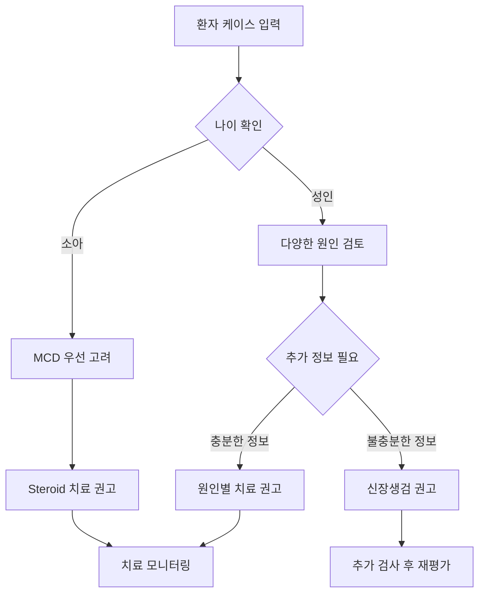

# Medical Agent

LangChain을 사용하여 구현한 의학 진단 및 치료 추천 에이전트입니다. 구조화된 도구들을 활용하여 의료진의 진단 과정을 지원합니다.

## 🏗️ 시스템 구조

```
┌─────────────────┐    ┌─────────────────┐    ┌─────────────────┐
│   User Input    │───▶│  LangChain      │───▶│   Tool Calling  │
│  (Case Study)   │    │   Agent         │    │   Functions     │
└─────────────────┘    └─────────────────┘    └─────────────────┘
                                │
                                ▼
                       ┌─────────────────┐
                       │   Response      │
                       │  Generation     │
                       └─────────────────┘
```

## 🛠️ 사용 가능한 도구 (Tools)

| Tool 명 | 기능 | 주요 입력 파라미터 | 출력 |
|---------|------|-------------------|------|
| `check_nephrotic_syndrome_criteria` | 신증후군 진단 기준 충족 여부 확인 | `proteinuria_g_per_day`, `albumin_g_dl`, `edema` | 신증후군 진단 여부 및 충족 기준 |
| `suggest_nephrotic_syndrome_cause` | 임상 정보 기반 원인 감별 | `age`, `diabetes`, `pla2r_positive`, `hematuria`, `known_cancer`, `response_to_steroid` | 가능한 원인 질환 (MCD, FSGS, MGN, DMN 등) |
| `recommend_nephrotic_syndrome_treatment` | 진단별 치료 방법 추천 | `diagnosis` (MCD, FSGS, MGN, DMN, Amyloidosis) | 질환별 구체적 치료 방침 |
| `summarize_nephrotic_syndrome_case` | 환자 케이스 종합 요약 | `age`, `sex`, `proteinuria_g_day`, `albumin_g_dl`, `edema`, `hematuria` | 환자 상태 종합 요약 |

### 📋 진단 기준 및 감별 질환

**신증후군 진단 기준:**
- 단백뇨 > 3.5 g/day
- 저알부민혈증 < 2.5 g/dL
- 부종 존재

**주요 감별 질환:**
- **MCD (미세변화병)**: 소아에서 가장 흔함, Steroid 반응성 좋음
- **FSGS (국소분절성 사구체경화증)**: Steroid 저항성, 예후 불량
- **MGN (막신장병)**: PLA2R 양성 시 일차성, 성인 남성에서 흔함
- **DMN (당뇨병성 신장병증)**: 당뇨병 병력, 혈뇨 없음
- **Amyloidosis**: AL형(혈액암), AA형(만성염증)

## 📊 실행 결과 분석

### Case 1: 21세 남성 환자


**실행된 함수 순서:**
1. `check_nephrotic_syndrome_criteria` → "신증후군 의심됩니다"
2. `suggest_nephrotic_syndrome_cause` → "신장생검이 필요할 수 있습니다"
3. `summarize_nephrotic_syndrome_case` → "21세 남성 환자, 신증후군 수준의 단백뇨"

### Case 2: 4세 남아 환자


**실행된 함수 순서:**
1. `summarize_nephrotic_syndrome_case` → "4세 남성 환자, 저알부민혈증, 부종 동반"
2. `suggest_nephrotic_syndrome_cause` → "소아 신증후군으로 미세변화병(MCD) 가능성이 높습니다"
3. `recommend_nephrotic_syndrome_treatment` → "Steroid가 1차 치료입니다"

## 🔄 Agent 워크플로우



## 🎯 주요 특징

- **구조화된 입력**: Pydantic 모델을 사용한 타입 안전성 보장
- **의료 가이드라인 기반**: 실제 신증후군 진단 및 치료 기준 반영
- **연령별 접근**: 소아와 성인의 다른 접근 방식 적용
- **단계별 의사결정**: 체계적인 진단 프로세스

## 🚀 사용 방법

```python
# Agent 초기화
agent = create_tool_calling_agent(llm=llm, tools=all_tools, prompt=prompt)
agent_executor = AgentExecutor(agent=agent, tools=all_tools, verbose=True)

# 케이스 실행
result = agent_executor.invoke({"input": "환자 케이스 설명..."})
print(result['output'])
```

## 📈 실행 결과 상세 분석

### Case 1: 21세 남성 환자
| 단계 | 호출된 Tool | 입력 데이터 | 출력 결과 |
|------|-------------|-------------|----------|
| 1 | `check_nephrotic_syndrome_criteria` | proteinuria: 10.2g/day<br>albumin: 2.7g/dL<br>edema: True | "신증후군 의심됩니다: 단백뇨 > 3.5 g/day, 부종" |
| 2 | `suggest_nephrotic_syndrome_cause` | age: 21<br>diabetes: False<br>hematuria: False<br>response_to_steroid: unknown | "신증후군의 원인을 명확히 판단하기 어려우며, 신장생검이 필요할 수 있습니다" |
| 3 | `summarize_nephrotic_syndrome_case` | age: 21, sex: male<br>proteinuria: 10.2g/day<br>albumin: 2.7g/dL<br>edema: True, hematuria: False | "21세 남성 환자입니다. 신증후군 수준의 단백뇨, 부종 동반" |

### Case 2: 4세 남아 환자  
| 단계 | 호출된 Tool | 입력 데이터 | 출력 결과 |
|------|-------------|-------------|----------|
| 1 | `summarize_nephrotic_syndrome_case` | age: 4, sex: male<br>proteinuria: 3.2g/day<br>albumin: 2.3g/dL<br>edema: True, hematuria: False | "4세 남성 환자입니다. 저알부민혈증, 부종 동반" |
| 2 | `suggest_nephrotic_syndrome_cause` | age: 4<br>diabetes: False<br>hematuria: False<br>response_to_steroid: unknown | "소아 신증후군으로 미세변화병(MCD) 가능성이 높습니다" |
| 3 | `recommend_nephrotic_syndrome_treatment` | diagnosis: MCD | "Steroid가 1차 치료입니다. 반응 없으면 생검 후 면역억제제 고려" |

### 실행 패턴 분석
| 항목 | Case 1 (21세) | Case 2 (4세) |
|------|---------------|--------------|
| 총 호출 함수 수 | 3개 | 3개 |
| 첫 번째 호출 | 진단 기준 확인 | 케이스 요약 |
| 두 번째 호출 | 원인 분석 | 원인 분석 |
| 세 번째 호출 | 케이스 요약 | 치료 권고 |
| 최종 결론 | 신장생검 필요 | MCD → Steroid 치료 |
| Agent 판단 근거 | 성인, 원인 불명확 | 소아 < 12세 → MCD |

---

*이 에이전트는 의료진의 진단 보조 도구로 설계되었으며, 실제 임상 결정은 전문의의 판단을 따라야 합니다.*