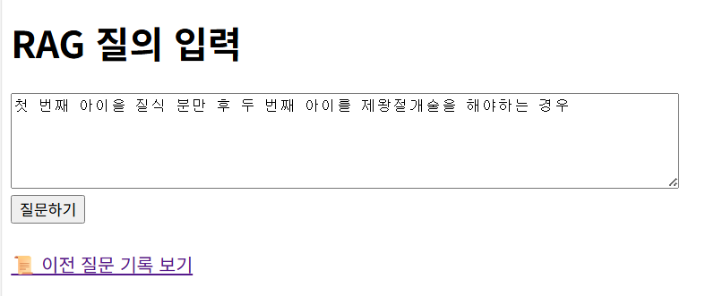
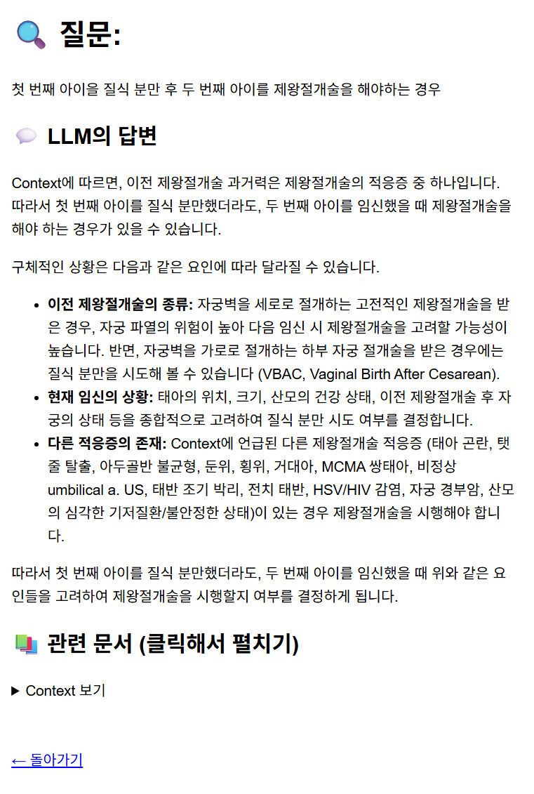
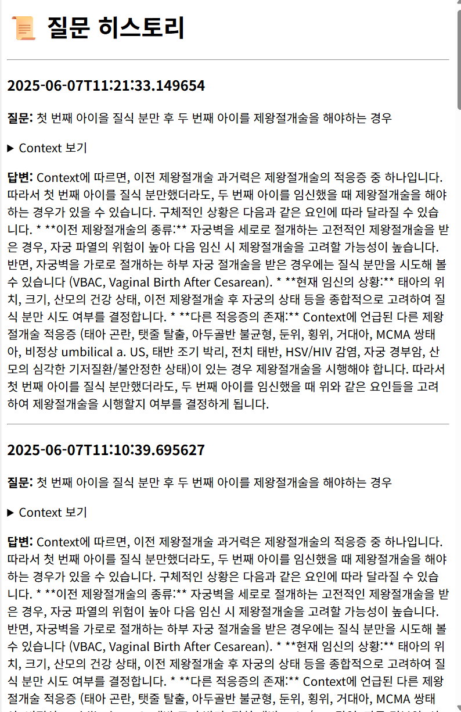

## 라우팅
| 경로 | 메서드 | 설명 |
|------|--------|------|
| `/` | GET, POST | 메인 페이지 – 질의 입력 및 결과 출력. 결과는 `result.html` 템플릿으로 렌더링됨 |
| `/history` | GET | 질의 기록 페이지. 로그 데이터를 `history.html` 템플릿으로 렌더링 |
| `/view/<path:subpath>` | GET | 로컬 HTML 파일 열람 – 경로에 따라 실제 파일을 브라우저에 표시 |

---

## 사용된 템플릿

| 템플릿 파일 | 설명 |
|-------------|------|
| `index.html` | 메인 페이지 – 사용자로부터 질의 입력을 받는 폼 제공 |
| `result.html` | 결과 페이지 – 질의에 대한 응답 및 참조 문서들을 출력 |
| `history.html` | 기록 페이지 – 이전 질의 및 응답 목록을 보여줌 |

---

## 애플리케이션 개요

HTML 문서를 벡터로 인덱싱한 후, 사용자 질의에 대해 관련 문서를 검색하고, Gemini LLM을 통해 자연어로 답변을 생성

- **문맥 검색**: Chroma + OpenAI Embeddings  
- **답변 생성**: Google Gemini API 사용  
- **질의 로그 저장**: `query_log.json`에 저장

---

## 주요 화면

| 메인 페이지 | 질의 결과 페이지 | 기록 페이지 |
|-------------|------------------|--------------|
|  |  |  |
